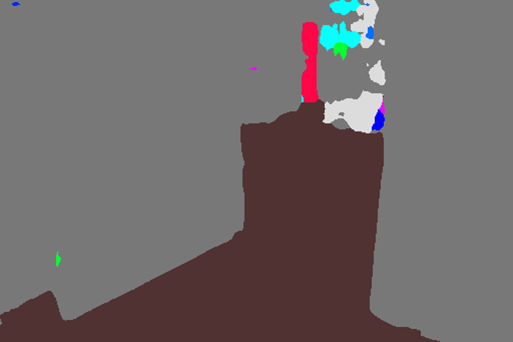

# 3D-Floor-Plane-Estimation-DeepLearning-Pipeline
Deep Learning pipeline I was working on to estimate the floor 3D plane using only one RGB monocular image. 

The pipeline includes an indoor semantic segmentation model, a depth predictor and 3D plane regression.

## Video
https://youtu.be/KefYTUQE6uk

## Images

## TO-DO
Some explanation if more than one person enters in here.
